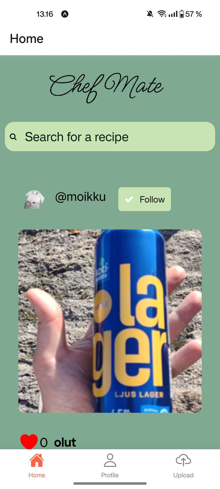
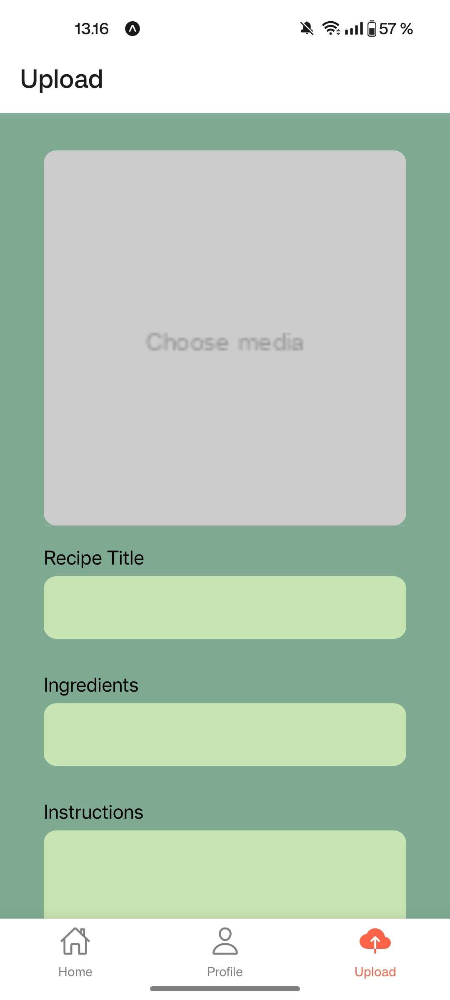
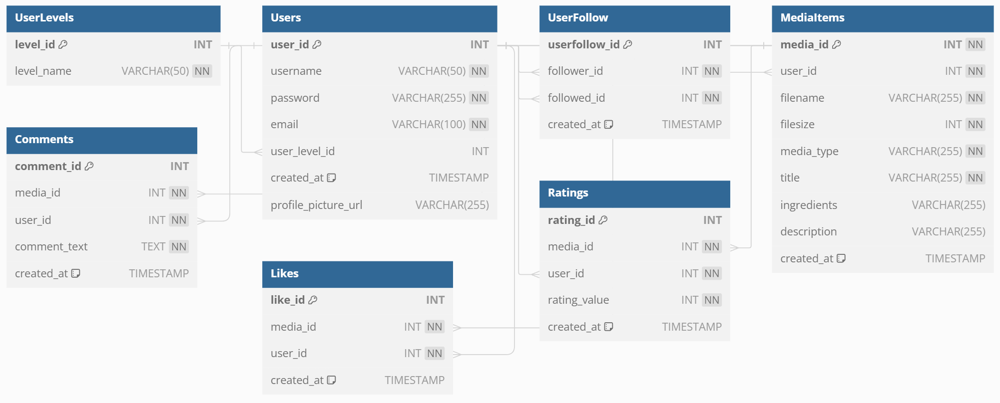

<h1>
    Chef Mate
</h1>

## Johdanto

Chef Mate on mobiilisovellus tarkoitettu ympäristöystävällisempään ruoanlaittoon.
Käyttäjät voivat jakaa omia reseptejään tai hakea reseptiä jo kotoa löytyvien raaka-aineiden perusteella, täten vähentäen kotitalouksien ruokahävikkiä.
Sovellus myös luo yhteisön ympäristötietoisille kuluttajille, jossa he pääsevät vuorovaikutukseen toistensa kanssa. Projekti on tehty Metropolian Monialustaprojekti-kurssin aikana.

## Sovelluksen käyttöliittymä

<table>
  <tr>
    <th>Home</th>
    <th>Profile</th>
    <th>Upload</th>
  </tr>
  <tr>
    <td></td>
    <td></td>
    <td></td>
  </tr>
</table>

## Sovelluksen toiminnallisuudet

Sovelluksessa on kolme sivua: kotisivu, profiilisivu ja upload sivu. Alla listataan sivujen toiminnallisuuksia.

Kotisivu

- Reseptien haku
- Reseptien selaaminen
- Käyttäjien seuraaminen
- Tykkäämään
- Arvioimaan

Profiilisivu

- Kirjautumaan ulos
- Näkemään omat käyttäjän seuraajamäärän & seurattavien määrän
- Vaihtamaan oman käyttäjänimen ja sähköpostin
- Näkemään tykätyt julkaisut
- Näkemään omat julkaisut

Upload

- Lisämään omia reseptejä

## Käytetyt teknologiat

- Sovelluksessa on käytetty seuraavia teknologioita: React Native, Node Js, Express Js & MySQL2

## [Projektin tietokanta](https://github.com/eeko1/Chef-Mate-Backend/blob/main/database.sql)

Jokaisella käyttäjällä voi olla useita media items, mutta jokainen media item kuuluu yhdelle käyttäjälle. Jokainen käyttäjä voi tykätä, arvostella ja arvioida useita media items. Jokainen käyttäjä voi seurata useita muita käyttäjiä, ja jokainen käyttäjä voi olla useiden käyttäjien seuraama. Media items voi olla useita tykkäyksiä, arvosteluja ja arvioita. Jokainen käyttäjä kuuluu yhteen käyttäjätasoon, mutta jokainen käyttäjätaso voi olla yhteydessä useisiin käyttäjiin.

## Back-end serverit

Linkit sovelluksen back-end servereihin, jotka pyörivät Metropolian serverillä. Käyttöön tarvitsee Metropolian VPN yhteyden.

- [Auth server](http://10.120.32.59/auth-api/api/v1)
- [Media server](http://0.120.32.59/media-api/api/v1)
- [Upload server](http://10.120.32.59/upload/api/v1)

## Front-end käyttöönotto

Lataa Expo Go sovellus puhelimeesi. Varmista, että olet samassa netissä kuin laite, jossa sovellus pyörii. Skanna QR-koodi. 

## Api Docs

Linkit sovelluksen api docseihin

- [Auth server](https://users.metropolia.fi/~eemiko/Apidocs/Auth-server/)
- [Media server](https://users.metropolia.fi/~eemiko/Apidocs/Media-Api/)
- [Upload server](https://users.metropolia.fi/~eemiko/Apidocs/Upload-server/)

## Testikansio

- [Auth server](https://github.com/eeko1/Chef-Mate-Backend/tree/main/servers/auth-server/test)

## CI/CD Pipeline

- [Front-end](https://github.com/eeko1/Chef-Mate-Frontend/tree/main/.github/workflows)
- [Back-end](https://github.com/eeko1/Chef-Mate-Backend/tree/main/.github/workflows)

## Sovelluksen rautalankamalli

[Linkki](https://www.figma.com/file/pSZZJuq3HMJxlCc6EUkCh0/chef-mate?type=design&node-id=1-2&mode=design&t=orntoBIQE01FHznn-0)

## Käytetty ikoni kirjasto

[Linkki](https://oblador.github.io/react-native-vector-icons/)

## Tekijät

Sovelluksen kehittäjien Github käyttäjät

- Eemi Korhonen - [eeko1](https://github.com/eeko1)
- Eemil Kärkkäinen - [eemiljka](https://github.com/eemiljka)
- Ellen Järvenpää - [ellenjarvenpaa](https://github.com/ellenjarvenpaa)
