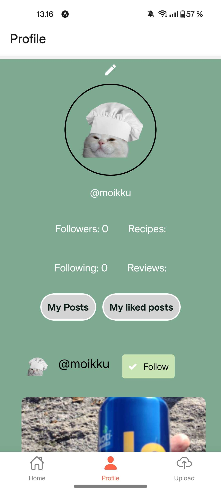

<h1>
    Chef Mate
</h1>

## Johdanto

Chef Mate on mobiilisovellus tarkoitettu ympäristöystävällisempään ruoanlaittoon.
Käyttäjät voivat jakaa omia reseptejään tai hakea reseptiä jo kotoa löytyvien raaka-aineiden perusteella, täten vähentäen kotitalouksien ruokahävikkiä.
Sovellus myös luo yhteisön ympäristötietoisille kuluttajille, jossa he pääsevät vuorovaikutukseen toistensa kanssa. Projekti on tehty Metropolian Monialustaprojekti-kurssin aikana.

## Sovelluksen käyttöliittymä

<table>
  <tr>
    <th>Home</th>
    <th>Profile</th>
    <th>Upload</th>
  </tr>
  <tr>
    <td></td>
    <td></td>
    <td></td>
  </tr>
</table>

## Sovelluksen toiminnallisuudet

Sovelluksessa on kolme sivua: kotisivu, profiilisivu ja upload sivu. Alla listataan sivujen toiminnallisuuksia.

Kotisivu

- Reseptien haku
- Reseptien selaaminen
- Käyttäjien seuraaminen
- Tykkäämään
- Arvioimaan

Profiilisivu

- Kirjautumaan ulos
- Näkemään omat käyttäjän seuraajamäärän & seurattavien määrän
- Vaihtamaan oman käyttäjänimen ja sähköpostin
- Näkemään tykätyt julkaisut
- Näkemään omat julkaisut

Upload

- Lisämään omia reseptejä

## Käytetyt teknologiat

- Sovelluksessa on käytetty seuraavia teknologioita: React Native, Node Js, Express Js & MySQL2

## [Projektin tietokanta](https://github.com/eeko1/Chef-Mate-Backend/blob/main/database.sql)

Each user can own multiple media items but each media item belongs to one user. Each user can like, rate and review multiple media items.
Each user can follow multiple other users and each user can be followed by multiple users. Media items can have multiple likes, ratings and reviews.
Each user belongs to one user level but each user level can be associated with multiple users.

## Back-end server

Chef Mate sovelluksen backend serveri löytyy tästä [linkistä](https://github.com/eeko1/Chef-Mate-Backend)

## Api Docs

Linkit sovelluksen api docseihin

- [Auth server](https://users.metropolia.fi/~eemiko/Apidocs/Auth-server/)
- [Media server](https://users.metropolia.fi/~eemiko/Apidocs/Media-Api/)
- [Upload server](https://users.metropolia.fi/~eemiko/Apidocs/Upload-server/)

## Testikansio

- [Auth server](https://github.com/eeko1/Chef-Mate-Backend/tree/main/servers/auth-server/test)

## CI/CD Pipeline

- [Front-end](https://github.com/eeko1/Chef-Mate-Frontend/tree/main/.github/workflows)
- [Back-end](https://github.com/eeko1/Chef-Mate-Backend/tree/main/.github/workflows)

## Sovelluksen rautalankamalli

[Linkki](https://www.figma.com/file/pSZZJuq3HMJxlCc6EUkCh0/chef-mate?type=design&node-id=1-2&mode=design&t=orntoBIQE01FHznn-0)

## Käytetty ikoni kirjasto

[Linkki](https://oblador.github.io/react-native-vector-icons/)

## Tekijät

Sovelluksen kehittäjien Github käyttäjät

- Eemi Korhonen - [eeko1](https://github.com/eeko1)
- Eemil Kärkkäinen - [eemiljka](https://github.com/eemiljka)
- Ellen Järvenpää - [ellenjarvenpaa](https://github.com/ellenjarvenpaa)
